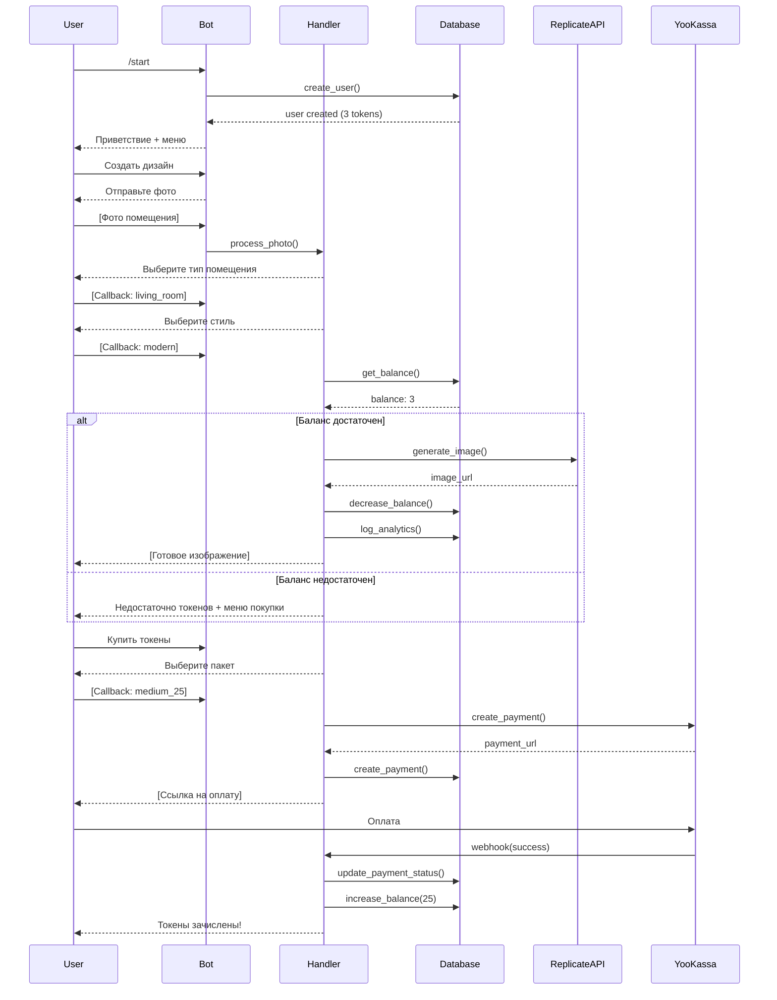

# 🏗️ Архитектура проекта InteriorBot-v2

## 📋 Оглавление

1. [Общее описание проекта](#общее-описание-проекта)
2. [Технологический стек](#технологический-стек)
3. [Структура проекта](#структура-проекта)
4. [Архитектура системы](#архитектура-системы)
5. [Компоненты системы](#компоненты-системы)
6. [Поток данных](#поток-данных)
7. [База данных](#база-данных)
8. [API и внешние сервисы](#api-и-внешние-сервисы)
9. [Система состояний (FSM)](#система-состояний-fsm)
10. [Обработка платежей](#обработка-платежей)
11. [Генерация изображений](#генерация-изображений)
12. [Административная панель](#административная-панель)
13. [Конфигурация и настройки](#конфигурация-и-настройки)
14. [Логирование и отладка](#логирование-и-отладка)
15. [Схемы взаимодействия](#схемы-взаимодействия)

---

## Общее описание проекта

**InteriorBot-v2** — это Telegram-бот для генерации дизайна интерьеров с использованием искусственного интеллекта. Бот позволяет пользователям создавать реалистичные визуализации интерьеров в различных стилях, используя модели DALL-E 3 через Replicate API.

### Основные возможности:

- ✅ Генерация дизайна интерьера по фотографии помещения
- ✅ 10+ стилей дизайна (современный, минимализм, скандинавский, индустриальный и др.)
- ✅ 12+ типов помещений (гостиная, спальня, кухня, ванная и др.)
- ✅ Система токенов с бесплатными генерациями для новых пользователей
- ✅ Интеграция платежной системы YooKassa
- ✅ Административная панель с аналитикой
- ✅ Подробное логирование и отладка

---

## Технологический стек

### Backend

- **Python 3.10+** — основной язык программирования
- **aiogram 3.x** — асинхронный фреймворк для Telegram Bot API
- **aiosqlite** — асинхронная работа с SQLite базой данных
- **asyncio** — асинхронное программирование

### AI & ML

- **DALL-E 3** (через Replicate API) — генерация изображений интерьеров
- **Stable Diffusion 3.5 Large** (резервная модель)
- **Replicate API** — платформа для запуска AI моделей

### Платежи

- **YooKassa** — прием платежей в России

### Инфраструктура

- **SQLite** — база данных
- **python-dotenv** — управление переменными окружения
- **aiohttp** — асинхронные HTTP-запросы

---

## Структура проекта

```
InteriorBot-v2/
├── bot/                          # Основная директория бота
│   ├── config.py                 # Конфигурация и настройки
│   ├── main.py                   # Точка входа приложения
│   │
│   ├── database/                 # Слой работы с базой данных
│   │   ├── db.py                # Database класс с методами
│   │   └── models.py            # SQL запросы и модели
│   │
│   ├── handlers/                 # Обработчики событий бота
│   │   ├── user_start.py        # Стартовые команды и меню
│   │   ├── creation.py          # Процесс генерации изображений
│   │   ├── payment.py           # Обработка платежей
│   │   ├── admin.py             # Административные команды
│   │   ├── design_step1_furniture.py  # Выбор мебели
│   │   ├── design_step2_colors.py     # Выбор цветовой гаммы
│   │   ├── design_mode_selector.py    # Выбор режима дизайна
│   │   └── webhook.py           # Webhook для платежей
│   │
│   ├── keyboards/                # Клавиатуры интерфейса
│   │   ├── inline.py            # Inline-клавиатуры (callback)
│   │   └── reply.py             # Reply-клавиатуры (основные)
│   │
│   ├── services/                 # Бизнес-логика и внешние сервисы
│   │   ├── replicate_api.py     # Работа с Replicate API (DALL-E 3)
│   │   ├── payment_api.py       # Работа с YooKassa
│   │   └── prompt_builder.py    # Построение промптов для AI
│   │
│   ├── states/                   # Машина состояний (FSM)
│   │   └── fsm.py               # Определение состояний бота
│   │
│   └── utils/                    # Вспомогательные утилиты
│       ├── texts.py             # Текстовые константы и сообщения
│       ├── helpers.py           # Вспомогательные функции
│       ├── navigation.py        # Навигация по меню
│       └── debug.py             # Инструменты отладки
│
├── requirements.txt              # Зависимости проекта
├── .gitignore                    # Игнорируемые файлы
├── test_dalle3_detailed.py       # Тестовый скрипт для DALL-E 3
├── README.md                     # Документация проекта
└── ARCHITECTURE.md              # Данный файл
```

---

## Архитектура системы

### Архитектурный паттерн

Проект использует **многослойную (Layered) архитектуру** с разделением ответственности:

```
┌─────────────────────────────────────────┐
│         Telegram Bot API                │
│     (Входная точка пользователя)        │
└──────────────┬──────────────────────────┘
               │
               ▼
┌─────────────────────────────────────────┐
│         Handlers Layer                  │
│   (Обработка команд и callback'ов)      │
│   - user_start.py                       │
│   - creation.py                         │
│   - payment.py                          │
│   - admin.py                            │
└──────────────┬──────────────────────────┘
               │
               ▼
┌─────────────────────────────────────────┐
│         Services Layer                  │
│      (Бизнес-логика)                    │
│   - replicate_api.py                    │
│   - payment_api.py                      │
│   - prompt_builder.py                   │
└──────────────┬──────────────────────────┘
               │
               ▼
┌─────────────────────────────────────────┐
│         Database Layer                  │
│    (Работа с данными)                   │
│   - db.py                               │
│   - models.py                           │
└──────────────┬──────────────────────────┘
               │
               ▼
┌─────────────────────────────────────────┐
│         SQLite Database                 │
│      (Хранилище данных)                 │
└─────────────────────────────────────────┘

        External Services:
┌─────────────────────────────────────────┐
│  - Replicate API (DALL-E 3)             │
│  - YooKassa (Payments)                  │
└─────────────────────────────────────────┘
```

### Принципы архитектуры

1. **Разделение ответственности** — каждый модуль отвечает за свою функциональность
2. **Асинхронность** — использование async/await для неблокирующих операций
3. **Слабая связанность** — модули независимы друг от друга
4. **Расширяемость** — легко добавлять новые стили, комнаты, функции
5. **Централизованная конфигурация** — все настройки в одном месте

---

## Компоненты системы

### 1. Main Entry Point (`main.py`)

**Назначение:** Точка входа приложения, инициализация и запуск бота.

**Ключевые функции:**

- Инициализация базы данных
- Регистрация роутеров обработчиков
- Настройка логирования
- Обработка ошибок
- Запуск polling

**Поток выполнения:**

```python
async def main():
    # 1. Инициализация БД
    await db.init_db()
    await db.init_analytics_table()
    
    # 2. Создание диспетчера
    dp = Dispatcher()
    
    # 3. Регистрация роутеров
    dp.include_router(user_start.router)
    dp.include_router(creation.router)
    dp.include_router(payment.router)
    dp.include_router(admin.router)
    # ...
    
    # 4. Настройка контекста
    dp["admins"] = ADMIN_IDS
    
    # 5. Запуск polling
    await dp.start_polling(bot)
```

### 2. Configuration (`config.py`)

**Назначение:** Централизованное управление настройками проекта.

**Основные параметры:**

```python
class Config:
    BOT_TOKEN: str                    # Telegram Bot API token
    REPLICATE_API_TOKEN: str          # Replicate API key
    YOOKASSA_SHOP_ID: str             # YooKassa shop ID
    YOOKASSA_SECRET_KEY: str          # YooKassa secret key
    DB_PATH: str = 'bot.db'          # Путь к БД
    FREE_GENERATIONS: int = 3         # Бесплатные генерации
    PAYMENT_PACKAGES: dict            # Пакеты токенов
```

**Пакеты токенов:**

- **Small:** 10 генераций — 290₽
- **Medium:** 25 генераций — 590₽
- **Large:** 60 генераций — 990₽

### 3. Database Layer (`database/`)

#### `db.py` — Database класс

**Назначение:** Управление всеми операциями с базой данных.

**Основные методы:**

**Пользователи:**

- `get_user(user_id)` — получить пользователя
- `create_user(user_id, username)` — создать пользователя
- `get_balance(user_id)` — получить баланс
- `increase_balance(user_id, amount)` — пополнить баланс
- `decrease_balance(user_id)` — списать 1 токен

**Платежи:**

- `create_payment()` — создать запись о платеже
- `get_pending_payment()` — получить ожидающий платеж
- `update_payment_status()` — обновить статус платежа

**Аналитика:**

- `log_analytics()` — записать событие
- `get_total_users()` — общее число пользователей
- `get_new_users_today()` — новые за сегодня
- `get_total_generations()` — всего генераций
- `get_total_revenue()` — общая выручка
- `get_popular_rooms()` — популярные комнаты
- `get_popular_styles()` — популярные стили

#### `models.py` — SQL запросы

**Таблицы базы данных:**

1. **users** — пользователи бота
2. **payments** — история платежей
3. **analytics** — аналитика использования

### 4. Handlers (`handlers/`)

#### `user_start.py`

**Функции:**

- `/start` — приветствие и регистрация пользователя
- Главное меню
- Информация о балансе
- Справка и поддержка

#### `creation.py`

**Процесс генерации:**

1. Пользователь отправляет фото помещения
2. Выбор типа помещения (гостиная, спальня и т.д.)
3. Выбор стиля дизайна
4. Проверка баланса
5. Генерация изображения через Replicate API
6. Отправка результата пользователю
7. Списание токена

#### `payment.py`

**Функции:**

- Показ доступных пакетов токенов
- Создание платежа в YooKassa
- Обработка статуса платежа
- Зачисление токенов после успешной оплаты

#### `admin.py`

**Административные команды:**

- `/admin` — панель управления
- Просмотр статистики
- Управление балансами пользователей
- Рассылка сообщений
- Аналитика по генерациям и платежам

#### `design_step1_furniture.py` и `design_step2_colors.py`

**Расширенный режим дизайна:**

- Детальный выбор параметров
- Выбор мебели
- Выбор цветовой гаммы
- Более точная настройка промпта

### 5. Services (`services/`)

#### `replicate_api.py`

**Главный сервис генерации изображений.**

**Поддерживаемые модели:**

- **DALL-E 3** (через Replicate) — основная модель ✅
- **Stable Diffusion 3.5 Large** — резервная модель

**Функции:**

```python
# Генерация промпта для DALL-E 3
get_dalle3_replicate_prompt(style: str, room: str) -> str

# Генерация изображения
generate_image(photo_file_id, room, style, bot_token) -> str | None

# DALL-E 3 генерация
generate_dalle3_replicate(room, style) -> str | None

# SD 3.5 генерация (резерв)
generate_sd35(room, style) -> str | None
```

**Стили дизайна:**

- `modern` — Современный минимализм
- `minimalist` — Минимализм
- `scandinavian` — Скандинавский
- `industrial` — Индустриальный лофт
- `rustic` — Рустик (деревенский)
- `japandi` — Японо-скандинавский
- `boho` — Богемный
- `mediterranean` — Средиземноморский
- `midcentury` — Середина века
- `artdeco` — Арт-деко

**Типы помещений:**

- `living_room` — Гостиная
- `bedroom` — Спальня
- `kitchen` — Кухня
- `bathroom` — Ванная
- `office` — Кабинет
- `dining_room` — Столовая
- `entrance` — Прихожая
- `wardrobe` — Гардероб
- `kids_room` — Детская
- `toilet` — Туалет
- `balcony` — Балкон
- `manroom` — Мужская комната

#### `payment_api.py`

**Интеграция с YooKassa:**

```python
async def create_payment(amount, description, user_id) -> dict
async def check_payment_status(payment_id) -> str
```

#### `prompt_builder.py`

**Построение промптов для AI:**

- Комбинирование стилей и помещений
- Добавление деталей и параметров
- Оптимизация для разных моделей

### 6. States (`states/fsm.py`)

**Состояния бота (FSM - Finite State Machine):**

```python
class CreationStates(StatesGroup):
    waiting_for_photo = State()        # Ожидание фото
    waiting_for_room = State()         # Выбор помещения
    waiting_for_style = State()        # Выбор стиля
    generating = State()               # Процесс генерации

class PaymentStates(StatesGroup):
    waiting_for_package = State()      # Выбор пакета
    waiting_for_payment = State()      # Ожидание оплаты

class AdminStates(StatesGroup):
    waiting_for_user_id = State()      # Ввод ID пользователя
    waiting_for_amount = State()       # Ввод суммы
    waiting_for_broadcast = State()    # Рассылка сообщения
```

### 7. Keyboards (`keyboards/`)

#### `inline.py`

**Inline-клавиатуры (callback buttons):**

- Выбор типа помещения
- Выбор стиля дизайна
- Выбор пакета токенов
- Административные действия

#### `reply.py`

**Reply-клавиатуры (основные кнопки):**

- Главное меню
- Навигация по разделам
- Быстрый доступ к функциям

### 8. Utils (`utils/`)

#### `texts.py`

**Текстовые константы:**

- Приветственные сообщения
- Инструкции
- Описания функций
- Сообщения об ошибках

#### `helpers.py`

**Вспомогательные функции:**

- Форматирование текста
- Валидация данных
- Конвертация форматов

#### `navigation.py`

**Навигация:**

- Построение меню
- Обработка переходов
- Breadcrumbs

#### `debug.py`

**Отладка:**

- Детальное логирование
- Дамп состояний
- Трейсинг запросов

---

## Поток данных

### Процесс генерации изображения



---

## База данных

### Схема БД (SQLite)

#### Таблица `users`

```sql
CREATE TABLE users (
    user_id INTEGER PRIMARY KEY,
    username TEXT,
    balance INTEGER DEFAULT 0,
    created_at TIMESTAMP DEFAULT CURRENT_TIMESTAMP,
    last_activity TIMESTAMP DEFAULT CURRENT_TIMESTAMP
);
```

**Описание полей:**

- `user_id` — Telegram ID пользователя
- `username` — Telegram username
- `balance` — Баланс токенов
- `created_at` — Дата регистрации
- `last_activity` — Последняя активность

#### Таблица `payments`

```sql
CREATE TABLE payments (
    id INTEGER PRIMARY KEY AUTOINCREMENT,
    user_id INTEGER,
    payment_id TEXT UNIQUE,
    amount INTEGER,
    tokens INTEGER,
    status TEXT,
    created_at TIMESTAMP DEFAULT CURRENT_TIMESTAMP,
    updated_at TIMESTAMP DEFAULT CURRENT_TIMESTAMP,
    FOREIGN KEY (user_id) REFERENCES users(user_id)
);
```

**Описание полей:**

- `id` — Внутренний ID платежа
- `user_id` — ID пользователя
- `payment_id` — ID платежа в YooKassa
- `amount` — Сумма в рублях
- `tokens` — Количество токенов
- `status` — Статус (`pending`, `succeeded`, `canceled`)
- `created_at` — Дата создания
- `updated_at` — Дата обновления

#### Таблица `analytics`

```sql
CREATE TABLE analytics (
    id INTEGER PRIMARY KEY AUTOINCREMENT,
    user_id INTEGER,
    action TEXT,
    room TEXT,
    style TEXT,
    status TEXT,
    cost REAL DEFAULT 1.0,
    timestamp TIMESTAMP DEFAULT CURRENT_TIMESTAMP,
    FOREIGN KEY (user_id) REFERENCES users(user_id)
);
```

**Описание полей:**

- `id` — ID события
- `user_id` — ID пользователя
- `action` — Тип действия (`generation`, `payment`, `error`)
- `room` — Тип помещения
- `style` — Стиль дизайна
- `status` — Статус (`success`, `failed`)
- `cost` — Стоимость операции
- `timestamp` — Время события

---

## API и внешние сервисы

### Replicate API (DALL-E 3)

**Endpoint:** `replicate.run("openai/dall-e-3", input={...})`

**Входные параметры:**

```python
{
    "prompt": "...",           # Текстовый промпт
    "size": "1024x1024",       # Размер изображения
}
```

**Выход:**

```python
# Возвращает объект FileOutput с URL изображения
output.url  # https://replicate.delivery/...
```

**Особенности:**

- ✅ Обход географических блокировок через Replicate
- ✅ Высокое качество генерации
- ✅ Понимает сложные промпты на английском
- ⚠️ Стоимость: ~$0.04 за изображение 1024x1024

### YooKassa Payment API

**Создание платежа:**

```python
POST https://api.yookassa.ru/v3/payments

Headers:
  Authorization: Basic {shop_id:secret_key (base64)}
  Idempotence-Key: {unique_key}
  Content-Type: application/json

Body:
{
  "amount": {"value": "290.00", "currency": "RUB"},
  "confirmation": {"type": "redirect", "return_url": "..."},
  "description": "Покупка 10 генераций",
  "metadata": {"user_id": 123456}
}
```

**Ответ:**

```python
{
  "id": "2c...",
  "status": "pending",
  "confirmation": {
    "type": "redirect",
    "confirmation_url": "https://yoomoney.ru/checkout/..."
  }
}
```

**Webhook уведомления:**

```python
POST {webhook_url}

Body:
{
  "type": "notification",
  "event": "payment.succeeded",
  "object": {
    "id": "2c...",
    "status": "succeeded",
    "metadata": {"user_id": 123456}
  }
}
```

---

## Система состояний (FSM)

### Finite State Machine

Бот использует машину состояний для управления многошаговыми процессами.

**Основные состояния:**

```python
┌─────────────┐
│    START    │
└──────┬──────┘
       │
       ▼
┌──────────────────┐
│ WAITING_FOR_PHOTO│
└──────┬───────────┘
       │ [photo received]
       ▼
┌──────────────────┐
│ WAITING_FOR_ROOM │
└──────┬───────────┘
       │ [room selected]
       ▼
┌──────────────────┐
│ WAITING_FOR_STYLE│
└──────┬───────────┘
       │ [style selected]
       ▼
┌──────────────────┐
│   GENERATING     │
└──────┬───────────┘
       │ [complete]
       ▼
┌──────────────────┐
│      DONE        │
└──────────────────┘
```

**Переходы между состояниями:**

- Автоматические (после завершения операции)
- По callback от пользователя
- По таймауту (возврат к началу)

---

## Обработка платежей

### Процесс оплаты

1. **Инициация платежа:**
   - Пользователь выбирает пакет токенов
   - Создается запись в БД со статусом `pending`
   - Создается платеж в YooKassa
   - Пользователю отправляется ссылка на оплату

2. **Оплата:**
   - Пользователь переходит на страницу YooKassa
   - Вводит данные карты
   - Подтверждает платеж

3. **Уведомление (Webhook):**
   - YooKassa отправляет webhook на сервер
   - Бот обрабатывает уведомление
   - Проверяет подпись
   - Обновляет статус платежа
   - Зачисляет токены пользователю

4. **Подтверждение:**
   - Пользователь получает уведомление об успешной оплате
   - Баланс обновляется

### Безопасность платежей

- ✅ Проверка подписи webhook от YooKassa
- ✅ Идемпотентность запросов (защита от дублей)
- ✅ Хранение чувствительных данных в переменных окружения
- ✅ Логирование всех платежных операций

---

## Генерация изображений

### Процесс генерации

1. **Получение фото:**
   - Пользователь отправляет фото помещения
   - Бот сохраняет file_id (для будущих версий)

2. **Построение промпта:**
   - Выбирается описание стиля из `STYLE_DESCRIPTIONS_DALLE3`
   - Выбирается описание помещения из `ROOM_DESCRIPTIONS`
   - Комбинируется детальный промпт на английском

3. **Отправка в API:**
   - Промпт отправляется в Replicate API
   - Вызывается модель DALL-E 3
   - Ожидание генерации (~20-40 секунд)

4. **Получение результата:**
   - Получение URL сгенерированного изображения
   - Отправка изображения пользователю
   - Логирование результата

### Структура промпта DALL-E 3

```python
f"""
Interior design photograph of a {room_description}.

STYLE: {detailed_style_description}

You are a Russian architect with world-class training.
You are a super designer who understands everything a Russian client wants.
Create a design that meets these requirements!

SETTING: Residential apartment, practical modern design.

LIGHTING: Soft, balanced natural and artificial lighting, 
without harsh shadows, realistic daylight, 
professional photography lighting.

COLOR PALETTE: Harmonious, not oversaturated, 
delicate and refined colors, warm shades, 
realistic interior colors, sophisticated mood.

DETAILS: Professional architectural interior photography, 
high quality, good composition, magazine-worthy, 
realistic proportions and perspective, 
attention to design detail, obvious practicality.

MOOD: Sophisticated, cozy, professional, thoughtful,
livable and functional, beautiful yet practical.

PHOTOGRAPHY: Shot by a professional interior designer photographer,
studio lighting, perfect exposure, sharp focus,
photography for a premium interior design magazine,
realistic rendering, no artificial effects.

NO: No cartoonish style, no unrealistic colors, no oversaturation,
no harsh lighting, no amateur photography, no cluttered spaces,
no overstuffed elements, only realism and professionalism.
"""
```

### Обработка ошибок

- Таймаут генерации (>60 секунд)
- Ошибки API (недостаточно средств, лимиты)
- Некорректный промпт (content policy)
- Сетевые ошибки

Все ошибки логируются и пользователю отправляется понятное сообщение.

---

## Административная панель

### Доступные команды

**Статистика:**

- `/admin` — главная панель администратора
- Просмотр общей статистики:
  - Всего пользователей
  - Новых за сегодня/неделю/месяц
  - Всего генераций
  - Генераций за сегодня
  - Выручка (всего/сегодня/неделя/месяц)

**Аналитика:**

- Популярные комнаты (топ-5)
- Популярные стили (топ-5)
- График активности пользователей

**Управление:**

- Добавление токенов пользователю
- Просмотр информации о пользователе
- Рассылка сообщений всем пользователям

### Права доступа

```python
ADMIN_IDS = [
    7884972750,
    827652042,
    5426993389,
    6999935990
]
```

Только эти Telegram ID имеют доступ к административным функциям.

---

## Конфигурация и настройки

### Переменные окружения (`.env`)

```env
# Telegram Bot
BOT_TOKEN=123456:ABC-DEF...

# Replicate API (DALL-E 3)
REPLICATE_API_TOKEN=r8_...

# YooKassa
YOOKASSA_SHOP_ID=123456
YOOKASSA_SECRET_KEY=live_...
```

### Настройки проекта

```python
# Бесплатные генерации для новых пользователей
FREE_GENERATIONS = 3

# Пакеты токенов
PAYMENT_PACKAGES = {
    'small': {'tokens': 10, 'price': 290},
    'medium': {'tokens': 25, 'price': 590},
    'large': {'tokens': 60, 'price': 990},
}

# Путь к базе данных
DB_PATH = 'bot.db'

# Выбор AI модели
USE_DALLE3_REPLICATE = True  # True = DALL-E 3, False = SD 3.5
```

---

## Логирование и отладка

### Система логирования

**Уровни логов:**

- `DEBUG` — детальная отладочная информация
- `INFO` — информационные сообщения
- `WARNING` — предупреждения
- `ERROR` — ошибки
- `CRITICAL` — критические ошибки

**Логи записываются:**

- В файл `bot.log` (UTF-8)
- В консоль (stdout)

**Формат лога:**

```
2024-11-27 00:06:15,123 - bot.handlers.creation - INFO - User 123456 generated image: living_room/modern
```

### Отладка

**Модуль `utils/debug.py`:**

- Детальный трейсинг запросов
- Дамп состояний FSM
- Мониторинг производительности
- Профилирование асинхронных операций

**Тестовый скрипт `test_dalle3_detailed.py`:**

- Прямое тестирование DALL-E 3 API
- Проверка промптов
- Отладка генерации изображений

---

## Схемы взаимодействия

### Жизненный цикл пользователя

```
┌──────────────┐
│   /start     │ → Регистрация (3 бесплатных токена)
└──────┬───────┘
       │
       ▼
┌───────────────┐
│  Главное меню │
└───┬───────┬───┘
    │       │
    │       └─────────────┐
    │                     │
    ▼                     ▼
┌────────────┐     ┌──────────────┐
│  Создать   │     │ Купить токены│
│  дизайн    │     │              │
└──────┬─────┘     └──────┬───────┘
       │                  │
       ▼                  ▼
┌────────────┐     ┌──────────────┐
│ Отправить  │     │   Выбрать    │
│   фото     │     │    пакет     │
└──────┬─────┘     └──────┬───────┘
       │                  │
       ▼                  ▼
┌────────────┐     ┌──────────────┐
│  Выбрать   │     │   Оплатить   │
│  комнату   │     │              │
└──────┬─────┘     └──────┬───────┘
       │                  │
       ▼                  ▼
┌────────────┐     ┌──────────────┐
│  Выбрать   │     │   Токены     │
│   стиль    │     │  зачислены   │
└──────┬─────┘     └──────┬───────┘
       │                  │
       ▼                  │
┌────────────┐            │
│ Генерация  │            │
│(-1 токен)  │            │
└──────┬─────┘            │
       │                  │
       ▼                  │
┌────────────┐            │
│ Результат  │            │
│  готов!    │            │
└──────┬─────┘            │
       │                  │
       └──────────────────┘
              │
              ▼
       ┌──────────────┐
       │ Повторить или│
       │  купить еще  │
       └──────────────┘
```

### Архитектура модулей

```
┌────────────────────────────────────────────────────────┐
│                     TELEGRAM BOT                        │
│                    (aiogram 3.x)                        │
└────────────────┬───────────────────────────────────────┘
                 │
                 ▼
┌─────────────────────────────────────────────────────────┐
│                    HANDLERS LAYER                        │
├──────────┬──────────┬──────────┬──────────┬─────────────┤
│user_start│ creation │ payment  │  admin   │design_steps │
└──────────┴──────────┴──────────┴──────────┴─────────────┘
     │            │          │         │            │
     ▼            ▼          ▼         ▼            ▼
┌─────────────────────────────────────────────────────────┐
│                    SERVICES LAYER                        │
├──────────────┬──────────────┬───────────────────────────┤
│replicate_api │ payment_api  │     prompt_builder        │
└──────────────┴──────────────┴───────────────────────────┘
     │                │                      │
     ▼                ▼                      │
┌──────────┐   ┌──────────┐                 │
│Replicate │   │ YooKassa │                 │
│   API    │   │   API    │                 │
└──────────┘   └──────────┘                 │
                                            ▼
                                   ┌─────────────────┐
                                   │  DATABASE LAYER │
                                   │     (db.py)     │
                                   └────────┬────────┘
                                            │
                                            ▼
                                   ┌─────────────────┐
                                   │ SQLite Database │
                                   │   (bot.db)      │
                                   └─────────────────┘
```

---

## Заключение

### Преимущества архитектуры

✅ **Модульность** — каждый компонент независим и легко тестируется  
✅ **Масштабируемость** — легко добавлять новые стили, комнаты, функции  
✅ **Асинхронность** — высокая производительность через async/await  
✅ **Читаемость** — четкая структура и понятные названия  
✅ **Расширяемость** — простое добавление новых обработчиков и сервисов  

### Возможности для развития

🚀 **Будущие улучшения:**

- Поддержка загрузки фото для img2img генерации
- Добавление новых AI моделей (Midjourney, Stable Diffusion XL)
- История генераций пользователя
- Сохранение избранных дизайнов
- Расширенная настройка параметров (освещение, мебель, цвета)
- Интеграция с платформами дизайнеров
- Мобильное приложение
- Веб-интерфейс для администраторов

### Контакты и поддержка

**Автор проекта:** InteriorBot Team  
**GitHub:** [https://github.com/severand/InteriorBot-v2](https://github.com/severand/InteriorBot-v2)  
**Вопросы и предложения:** Создавайте Issues в GitHub репозитории

---

*Документация актуальна на: 27 ноября 2024*  
*Версия: 2.0*